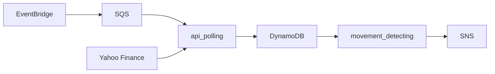

# NVIDIA Price Movement Detector
**stock-price-movement** detects movements to NVIDIA stock price using market data fetched from [Yahoo!Ⓡ finance](https://finance.yahoo.com/). In current configuration of the application, the threshhold is ±$0.50 in a 5 minute interval

The **stock-price-movement** project is built on top of AWS serverless technologies. In particular, the business logic is implemented via AWS Lambdas running Python code. Additionally, an instance each of AWS EventBridge, AWS SQS, AWS DynamoDB, and AWS SNS are deployed to form the rest of the application system. Serverless resources are deployed via the AWS SAM CLI, which reads the AWS Cloudformation template engineered as a part of the **stock-price-movement** project. In other words, resources are provisioned via IaC (Infrastructure as Code) rather than manually through the AWS console

The diagram above illustrates the flow of information in the application system. api_polling and movement_detecting are lambda functions defined in the project repository

You can read my brief reflections on ---to be included---

## Accessing the Production Service
The output of **stock-price-movement** is an SNS notification every time a movement is detected. A Gmail account has been created and is subscribed to the SNS notifications for the purpose of demonstration. You can access the Gmail inbox via:  

Email Address: nvda.stock.price.movement@gmail.com  
Email Password: Password@123  

Please be considerate and treat the Gmail account as read only

## Deploying the CloudFormation Stack

If you have not done so already, create an AWS root account. Afterwards, having signed into the console, use AWS IAM Identity Center (Important! Not AWS IAM! (this can be confusing)) to create a management account with an **AdministratorAccess** permission set. In accordance with best practices, it is highly recommended that you sign in to the console from now via your management account, not your root account

Download the AWS CLI and AWS SAM CLI tools on your local machine.  

Run the config wizard via ```aws configure sso``` and enter your management account information  
Login via ``aws sso login --profile <your-management-account-name-here>``  

Clone the repo via ```git clone https://github.com/Jason0h/shorten-url.git``` and enter via ```cd shorten-url```

Build the stack via ```sam build ```  
Deploy the stack to AWS via ```sam deploy --profile <your-management-account-name-here>```

## Running Unit Tests Locally

Prerequisite: ```Python3``` installed on your local machine

Install dependencies in a virtual environment via
```
python3 -m venv .venv
. .venv/bin/activate
pip install -r tests/requirement.txt
pip install -r api_polling/requirements.txt
pip install -r movement_detecting/requirements.txt
```
Run unit tests via
```
pytest tests/unit
```
