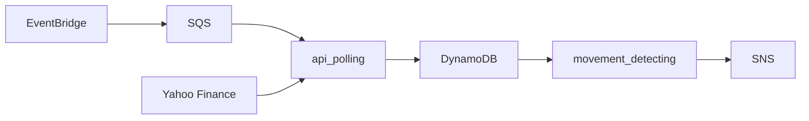

# NVIDIA Price Movement Detector
**stock-price-movement** detects movements to NVIDIA stock price using market data fetched from [Yahoo!Ⓡ finance](https://finance.yahoo.com/). In current configuration of the application, the threshhold is ±$0.50 in a 5 minute interval

The **stock-price-movement** project is built on top of AWS serverless technologies. In particular, the business logic is implemented via AWS Lambdas running Python code. Additionally, an instance each of AWS EventBridge, AWS SQS, AWS DynamoDB, and AWS SNS are deployed to form the rest of the application system. Serverless resources are deployed via the AWS SAM CLI, which reads the AWS Cloudformation template engineered as a part of the **stock-price-movement** project. In other words, resources are provisioned via IaC (Infrastructure as Code) rather than manually through the AWS console

The diagram above illustrates the flow of information in the application system. api_polling and movement_detecting are lambda functions defined in the project repository

You can read my brief reflections on ---to be included---

## Accessing the Production Service
